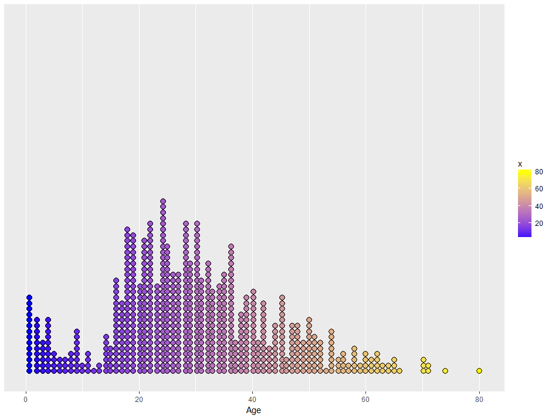
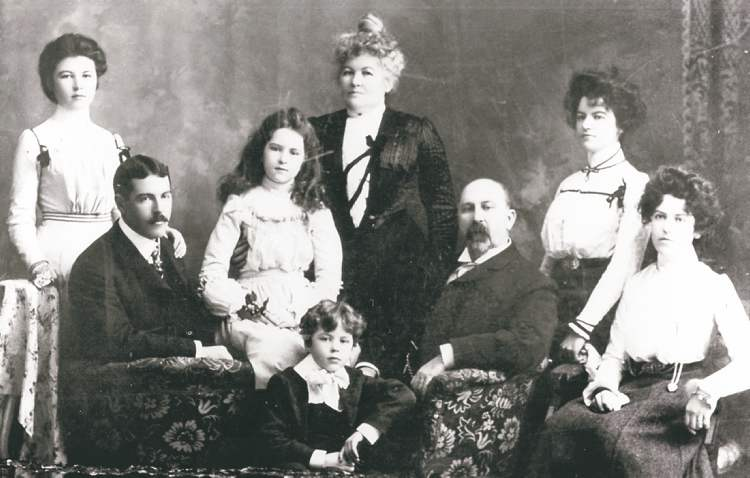

```{r setup, include=FALSE}
knitr::opts_chunk$set(echo = TRUE)
library(learnr)
library(tidyverse)
library(titanic)
```

<center>
{width=20%}
</center>


<center>
{width=80%}
</center>

<br>

During our last lecture on R, we went over basic manipulation of data objects (vectors, data frames). We also introduced the ggplot framework for data visualization as a flexible alternative to the base plotting functions. Today we will discuss these two topics in more detail.

One unique feature of R is a collection of libraries collectively known as the "tidyverse". The tidyverse is a set of professional-grade tools that allow data scientists and researchers to manipulate and display data. We will be going through some members of the tidyverse in our lecture today.

### Setting up tidyverse

First install tidyverse:
`install.packages("tidyverse")`

Then load tidyverse:
`library(tidyverse)`

### Loading the Data

First install the Data Package:
`install.packages("titanic")`

Then load the Data:
`library(titanic)`

### Inspecting the Data

```{r}
str(titanic_train)
```

### `dplyr` Basics

`dplyr` is a package that contains tools for manipulating data, distinct from the way that we have manipulated data thus far (with square brackets, dollar signs, etc.). It utilizes functions to manipulate data rather than operators and notation, making manipulations more readable and intuitive to use. The functions we'll take a look at include:

* `mutate()`
* `select()`
* `filter()`
* `summarise()`
* `arrange()`
* `group_by()`

`dplyr` Cheat Sheet: https://www.rstudio.com/wp-content/uploads/2015/02/data-wrangling-cheatsheet.pdf

#### `mutate()`

`mutate()` is a function that takes a dataframe and adds a variable. You can specify this new column of data in terms of other columns of data.

For example, the dataset `titanic` has ticket prices in 1912 pounds. The 1912 pound is worth about 108 modern pounds. We can use `mutate()` to append a variable `modern_price` to the dataset.

```{r}
titanic_train <- mutate(titanic_train, modern_price = Fare*108)

head(titanic_train)
```

#### Exercise

Using the above framework, add a variable for the modern fare price in dollars. (The pound is worth ~1.3 dollars today)

```{r Mutate, exercise = TRUE}
# Your code here
```

`mutate()` is not limited to adding new variables. It can also be used to change existing variables if called in a specific but intuitive way. Can you modify the modern fare price variable to make it in terms of cents without creating a new variable?

```{r Mutate2, exercise = TRUE}
# Your code here
```

#### `select()`

`select()` allows you to reference specific variables in a dataframe (as opposed to all variables) and returns a reduced-size data frame.

To reference the newly created `modern_price` variable:

```{r}
head(select(titanic_train, modern_price))
```

You can also select multiple variables at once:

```{r}
head(select(titanic_train, modern_price, Fare))
```

#### Exercise

Suppose we were running an analysis of how much each class of ticket cost (In modern and period terms). Many of the columns in the `titanic` dataframe are irelevant for a task like this. Use `select()` to make a dataframe with only relevant variables.

```{r select, exercise = TRUE}
# Your code here
```

#### filter()

`filter()` allows you to obtain a subset of rows much in the same way that `select` allows you to obtain a subset of columns. For example, if want to get a data frame of only third class passengers:

```{r}
head(filter(titanic_train, Pclass == 3))
```

#### Exercise

Use `filter` to obtain a dataframe containing only the information of the female passengers.

```{r filter, exercise = TRUE}
# Your code here
```

#### `summarise()`

Gives a summary of data in a single value (using a function of choice). This can be used to calculate means, medians, and other descriptive statistics about your data.

```{r}
summarise(titanic_train, avg = mean(modern_price))
```

#### Exercise

Calculate the mean and median of the ages of the passengers using one `summarise()` call. What do the mean and median tell you about the distribution of the ages of the passengers (e.g. symmetry, skewness)

```{r summarise, exercise = TRUE}
# Your code here
```

#### `arrange()`

Orders the rows of a dataframe by the values of a column. For example, to order the data by the ages of the passengers (low to high is the default)

```{r}
head(arrange(titanic_train, Age))

# Reversing the order

head(arrange(titanic_train, desc(Age)))
```

#### `group_by()`

Groups data into rows with the same values for a certain variable.

```{r}
group_by(titanic_train, Pclass)
```

Note that the `group_by` function is not changing the order of the rows, but is rather "labeling" them by the rule that you specify in the function call. 

We can observe an application of the grouping by using the summarise function.

```{r}
summarise(group_by(titanic_train, Pclass), avg = mean(modern_price))
```

#### Exercise

The passenger class is a natural stratification for most of the variables of interest in our dataframe. Use a compound `summarise` and `group_by` call to calculate the stratified proportion of survival for each passenger class.

```{r summarise and group_by, exercise = TRUE}
# Your code here
```


### Another Look at `ggplot2` 

`ggplot2` Cheat Sheet: https://www.rstudio.com/wp-content/uploads/2015/03/ggplot2-cheatsheet.pdf

Last lecture, we went over the `ggplot` framework for plotting data. As a refresher, below is how we would plot a histogram of fares from our `titanic` dataset.

```{r}
ggplot(data = titanic_train, aes(x = Fare))
```

```{r}
ggplot(data = titanic_train, aes(x = Fare)) + geom_histogram() 
```

Today, we will go into more detail about exactly what options you have for plotting data in the `ggplot2` package.

### ggplot Example 1: Inspecting Fares

Let's first recreate the Fare histogram from above but add and change a few things.


```{r}
ggplot(data = titanic_train, aes(x = Fare)) + 
  geom_histogram(binwidth = 10, fill = "cornflowerblue")
```

Add a rug plot:

```{r}
ggplot(data = titanic_train, aes(x = Fare)) + 
  geom_histogram(binwidth = 10, fill = "cornflowerblue") + 
  geom_rug() 
```

Add a title and axis labels:

```{r}
ggplot(data = titanic_train, aes(x = Fare)) + 
  geom_histogram(binwidth = 10, fill = "cornflowerblue") + 
  geom_rug() + 
  ggtitle("Distribution of Fares on the Titanic") + 
  xlab("Fare (1912 pounds)") + ylab("Num Passengers")
```

A natural question we might have is what did the Fare distribution look like for each of the 3 Passenger Classes?

Instead of using `dplyr` to split our data into 3 separate datasets for each of the three classes and then making three separate plot, we can just use one of the awesome features of ggplot, `facet_wrap()`! 

`facet_wrap()` will split up your data by the column you pass as it's argument. Just make sure to put a tilde (~) in front of the column name!

```{r}
ggplot(data = titanic_train, aes(x = Fare, color = factor(Pclass))) + 
  geom_density() + 
  facet_wrap(~ Pclass) 
```

Fit the x axis to the data for each facet:

```{r}
ggplot(data = titanic_train, aes(x = Fare, color = factor(Pclass))) + 
  geom_density() + 
  facet_wrap(~ Pclass, scales = "free") 
```

Remove the useless legend:

```{r}
ggplot(data = titanic_train, aes(x = Fare, color = factor(Pclass))) + 
  geom_density() + 
  facet_wrap(~ Pclass, scales = "free") + 
  theme(legend.position = "none") 
```

Add an x label:

```{r}
ggplot(data = titanic_train, aes(x = Fare, color = factor(Pclass))) + 
  geom_density() + 
  facet_wrap(~ Pclass, scales = "free") + 
  theme(legend.position = "none") + 
  xlab("Fare (1912 pounds)")
```

Let's go back and see how the median Fare for each of the classes compares.

As you can see, calculating the median using nested functions can be kind of dizzying. Stay tuned to see how we can make our code more readable. 

```{r}
first_class_median = median(select(filter(titanic_train, Pclass == 1), Fare)[[1]])
second_class_median = median(select(filter(titanic_train, Pclass == 2), Fare)[[1]])
third_class_median = median(select(filter(titanic_train, Pclass == 3), Fare)[[1]])
```

Here we're making the same histogram from earlier, but add a `geom_vline()` for each of the median values calculated above.

```{r}
ggplot(data = titanic_train, aes(x = Fare)) + 
  geom_histogram(binwidth = 10) 
```

Add a vertical line for each of the medians:

```{r}
ggplot(data = titanic_train, aes(x = Fare)) +
  geom_histogram(binwidth = 10) + 
  geom_vline(aes(xintercept = first_class_median, color = "First")) + 
  geom_vline(aes(xintercept = second_class_median, color = "Second")) + 
  geom_vline(aes(xintercept = third_class_median, color = "Third"))
```

Add a title and axis labels:

```{r}
ggplot(data = titanic_train, aes(x = Fare)) + geom_histogram(binwidth = 10) + 
  geom_vline(aes(xintercept = first_class_median, color = "First")) + 
  geom_vline(aes(xintercept = second_class_median, color = "Second")) + 
  geom_vline(aes(xintercept = third_class_median, color = "Third")) + 
  ggtitle("Distribution of Fares on the Titanic") + 
  xlab("Fare (1912 pounds)") + ylab("Num Passengers")
```


### ggplot Exercise 1: Faceting

Create a density plot of `Fare` with a rug plot for each of the genders. Here is what your plot should look like:

{width=80%}


```{r facet_wrap, exercise = TRUE}
# Your code here
```

### ggplot Example 2: Inspecting Ages

Replicate the plot below:

{width=80%}

Hint: Use the `ggplot2` Cheat Sheet listed above to help out!

```{r Ages, exercise = TRUE}
# Your code here
```


### Example: Title and survival rate

But first a little grammar lesson. In the early 1900s there were four common titles assigned to people:

* Mr. - Male over the age of ~14
* Mrs. - Married Female
* Master - Male under the age of ~14
* Miss. - Unmarried Female

<br>

<center>
{width=60%}
</center>

<br>

First, select the `Name` column from the data.

```{r}
names = select(titanic_train, "Name")[[1]]
head(names)
```

Second, use `str_detect()` from the `stringr` package.

`stringr` Cheat Sheet: http://edrub.in/CheatSheets/cheatSheetStringr.pdf

`str_detect(string, pattern)`

Input Arguments:

* `string`: vector of strings
* `pattern`: pattern you want to look for in each element of `string`

Return Value:

* Logical (boolean) vector of whether each element of `string` contains `pattern`

```{r}
mr = str_detect(names, "Mr.")
mrs = str_detect(names, "Mrs.")
miss = str_detect(names, "Miss.")
master = str_detect(names, "Master")
head(mr)
```

But what about people who have different titles? In fact there aren't too many that have a title other than one of the four from above but let's take a look. 

```{r}
leftovers = filter(titanic_train, !mr & !mrs & !miss & !master)$Name
leftovers
```


#### The Pipe Operator `%>%`

As mentioned earlier, nested functions can look nasty and be hard to read. To fix this `tidyverse` makes use of the Pipe Operator.

To get the survival outcome of only the "Mr.'s" using `dplyr`, we have two option:

1. Nested Functions: `select(filter(titanic_train, mr), "Survived")`
2. The Pipe Operator: `titanic_train %>% filter(mr) %>% select("Survived")`

Whatever is on the left side of `%>%` is passed in as the first argument of the function immediately to the right of `%>%`. Thus, the Pipe Operator reduces the number of arguments to a function by 1.

In this case the order of the functions doesn't actually matter. Whether you use the Pipe Operator or not is just a matter of preference.

```{r}
mr_outcomes = select(filter(titanic_train, mr), "Survived")[[1]]
mrs_outcomes = select(filter(titanic_train, mrs), "Survived")[[1]]
miss_outcomes = select(filter(titanic_train, miss), "Survived")[[1]]
master_outcomes = select(filter(titanic_train, master), "Survived")[[1]]
mr_outcomes
```

Now that we have the survival outcomes (1 = survive, 0 = die) for each of the common titles, let's just calculate the survival rate for each.

```{r}
mr_survival = sum(mr_outcomes)/length(mr_outcomes)
mrs_survival = sum(mrs_outcomes)/length(mrs_outcomes)
miss_survival = sum(miss_outcomes)/length(miss_outcomes)
master_survival = sum(master_outcomes)/length(master_outcomes)
mr_survival
```

Finally, let's create an awesome ggplot to help us visualize the results.

Note: We need to change the `stat` argument in `geom_bar()` becuase the y variable in our plot is itself a column of the data frame. The default value for `stat` counts the number of occurrences at each x position. It turns out that ggplot has a separate function, `geom_col()`, that is equivalent to `geom_bar(stat="identity")`. 

```{r}
common_titles = c("Mr.", "Mrs.", "Miss", "Master")

title_data = data.frame("Title" = common_titles, "prop" = c(mr_survival, mrs_survival, miss_survival, master_survival))

ggplot(title_data, aes(x=Title, y=prop, fill = common_titles)) + 
  geom_bar(stat="identity") +
  #geom_col() +
  ylab("Survival Rate") + 
  ggtitle("Survival Rate By Title") + 
  scale_fill_manual(values = c("skyblue", "pink", "skyblue", "pink")) +
  theme(legend.position = "None")
```

What do you think of the results? Is it what you expected? After all there was a tendency to save the "women and children first". Why do you think that the survival rate of the unmarried women (who tend to be younger) is lower than that of the married women? How could you use the data to see if social status effects survival rate?

Hint: It turns out that for each of the common titles, **except** for "Mrs.", 3rd Class contains the most individuals.


